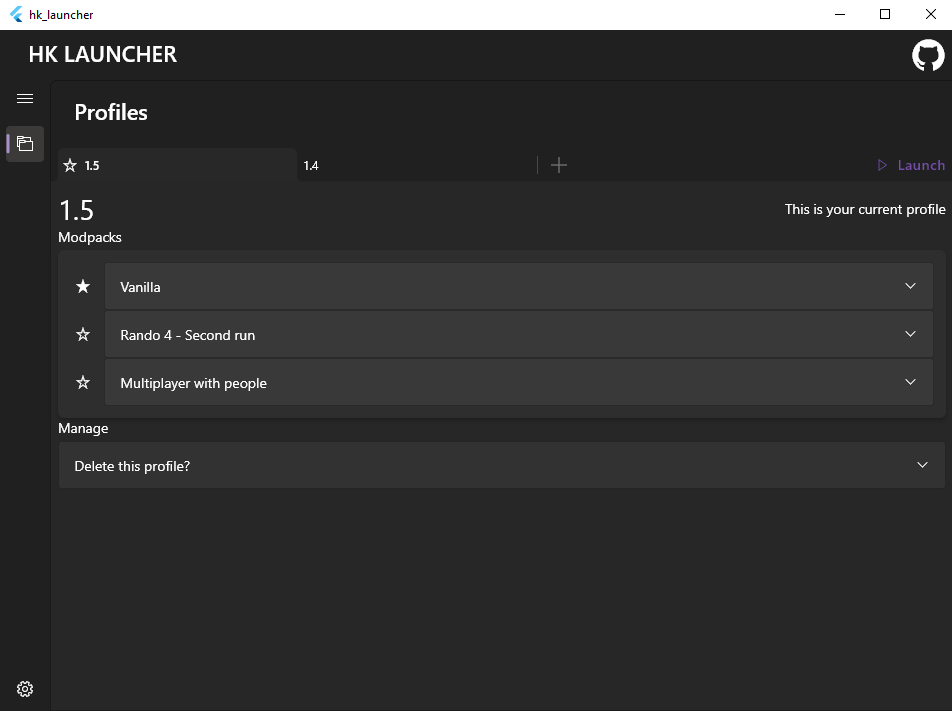

# hk_launcher

A Hollow Knight launcher/modpack manager for Windows.

## About
This app aims to solve the problem I struggle with. When playing modded Hollow Knight, you have to always make sure you are using correct mods and load the right save files. Otherwise, they may become corrupted. For example, if you are doing a modded run and then decide to try out a different set of mods, you will need to uninstall all your current mods, intall the other set and then after playing with it do the process in reverse. This becomes a mess when you play HK multiplayer with several different groups of people, and chances of installing wrong mod versions and corrupting your save files become very high.

This is where this app comes to play. It lets you switch between different sets of mods and saves without needing to do any manual copying and remembering what mods you have used for what. Follow the process below to get started.

## Getting Started
- Download the [latest release](../../releases/latest) from the releases section
- Extract and run it
- Carefully read the disclaimer (read the last point in this list if you've missed it)
- On the Main page you will see a plus button. Click it to create a new profile
  - Each profile essentially corresponds to a separate HK installation. For example, if you have Hollow Knight v1.5 and v1.4 installed, then you should create 2 profiles matching these versions
  - You can also have multiple installations of the same version, if you want to (with separate profiles for each of them). You can find guides on how to do this on [speedrun.com](https://www.speedrun.com/hollowknight/guides)
  - When creating a profile you also need to specify the Hollow Knight version this profile will be using. This is because different versions have slightly different file names (this also could be a GOG thing, so feel free to tell me if this is different on Steam)
- After your first profile was created, you will see that it has one 'modpack', called 'Vanilla'
  - You can think of each modpack as a copy of your game with a specific set of mods and saves
  - The app assumes that your installation didn't have any mods installed on it (hence the name of the first modpack). Therefore, you can duplicate the Vanilla modpack and install whatever set of mods you want. Switching back to Vanilla will essentially make this installation unmodded. You can also install mods before creating the profile. Then, all your modpacks will be modded by default
  - Basically it's up to you how to use the app, why am I even writing this
- That's pretty much it. When you are done using the app and want to go back to your basic Hollow Knight, you can use an option in the Settings to revert everything
  - However, keep in mind that your save files will not be restored (this is becuase after you played with profiles, it's now up to you to decide what saves you consider your original). Therefore, I recommend to copy your saves to a safe place whenever you are unsure what will happen to them